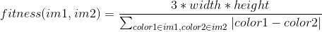

[toc]

## 背景故事

> 这是个真实的故事。
>从前在海岸边有一群扇贝在悠哉游哉地生活繁衍着。它们自然是衣食不愁，连房子也有了着落。它们担忧的只有一件事：每隔一段时间，总有一个人来挖走它们之中的一部分。当然啦，挖回去干什么这大家都知道。但扇贝们不知道的是，这人的家族图腾是Firefox的图标，所以他总是选择那些贝壳花纹长得比较不像Firefox图标的扇贝。
>这种状况持续了好几十万代。大家应该也猜到扇贝们身上发生什么事情了：它们的贝壳上都印着很像Firefox图标的图案。

这个故事是在[科学松鼠会：遗传算法：内存中的进化](https://songshuhui.net/archives/10462)一文中讲述的。我复刻了这个帖子，并改（zhao）进（chao）了[GA-Firefox_C++实现](https://github.com/m1nt07/GA-Firefox-)以及[GA-Firefox_Python实现](https://github.com/tjuxiaoyi/GA-firefox)，创造了一个图腾是Chrome图标的扇贝🐚家族(Chrome大法好！🤪）。

## 结果
过程：
原始图标：
运行了4w轮后的结果：
## 问题详解
为了模拟扇贝（shell）的花纹，假设扇贝上有100个半透明的三角形。这些三角形有着随机的颜色以及随机的位置。同时，约定三角形的颜色以及位置是由单条染色体（chromosome）决定的。每条染色体上有9个基因（gene），分别决定三角形顶点坐标以及RGB颜色分量。每个种群（ population）中有着若干个个体（individual），即扇贝。为了方便计算，假设扇贝长成了正方形（👅），并且大小与图标大小一致。

### 扇贝花纹生成算法
这个地方我踩了个重坑。最开始我的实现方法是，创建一个RGBA四通道的画布，之后在画布上直接绘制三角形。这样生成出来的图形，有一个非常明显的问题。就是后画上去的图形必定会覆盖之前画上去的图形，半透明效果直接消失。之后参考了[GA-Firefox_C++实现](https://github.com/m1nt07/GA-Firefox-)与alphablend算法。
具体是这样的，将100个三角形视作100个图层。将新的三角形叠加至之前的图层时，创建一个与新的三角形一样的蒙版，蒙版中三角形区域的值为128，表示半透明。这样叠加之后，就可以避免上层覆盖下层的情况。可以参考下图（下图中融合后的图有一个错误，背景的蓝色三角形与绿色三角形相交的区域颜色不太对，但是我不会调）。


## 遗传算法及策略

### 衡量适应度
由于图形是RGB三通道，直接将图像的L1距离的倒数乘以规模作为适应度。

<!-- $$fitness(im1, im2) = \frac{3 * width * height}{\sum_{color1\in im1, color2\in im2}|color1 - color2|}$$ -->

### 选择过程
选择是基于一个给定的淘汰率（knock_rate)来进行的。这里没有用轮盘赌算法，只是简单的将最菜的几个个体淘汰，再用最好的个体与次好的个体交叉，得到的子代填补上空缺。

### 交叉过程
每次从种群中**无放回**的选取两个扇贝，根据指定的交叉率（cross_rate)决定是否交叉。交叉过程中，以50%的概率交换他们的染色体。

### 变异过程
每个扇贝根据变异率(mutate_rate)来进行变异。变异时，随机重置一个染色体为随机值。

## 源码
源码存放在[GeneraticAlgIcon代码仓库中](https://github.com/LebranceBW/GeneraticAlgIcon)。
### 运行环境
Python 3.6.7。主要用了Pillow库。
### 下载与安装
```bash
git clone git@github.com:LebranceBW/GeneraticAlgIcon.git && cd GeneraticAlgIcon
pip install -r requirements.txt
python3 main.py
```